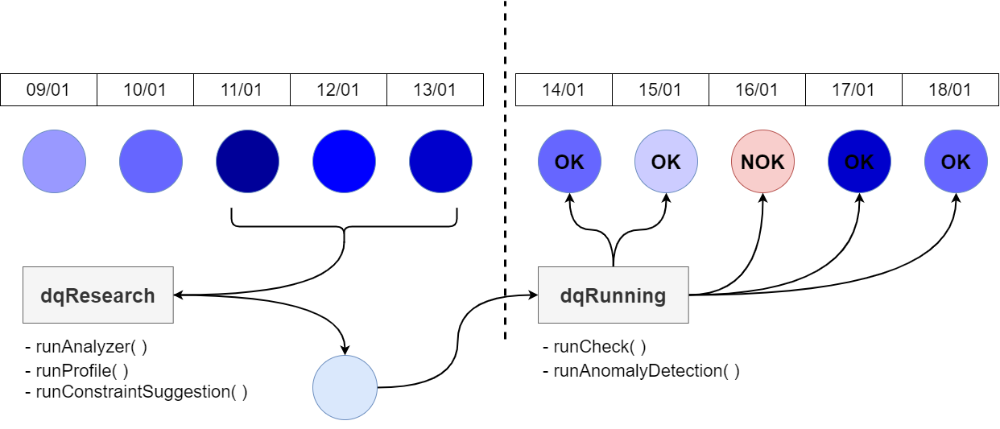

## Sumário

* ### dqResearch/
   * reserach-tutorial.ipynb
   * tutoriais/
       * analyzer.ipynb
       * profile.ipynb
       * suggestions.ipynb
* ### dqRunning/
   * arquitetura/
       * imagens/
           * dqOutput_architecture.png
           * dqRunning_architecture.png
           * dqRunning_overallJudgement.png
           * dqRunning_verificationSuite.png
           * dqRunning_viewYamlStructure.png
           * modulesRelationship.png
       * pdf/
           * imagens/
               * data_transformations.png
           * data_transformations.pdf
   * documentacao/
       * anomalyDetec_infraYaml.ipynb
       * anomalyDetec_vsYaml.ipynb
       * check_infraYaml.ipynb
       * check_vsYaml.ipynb
       * inputData.ipynb
       * view.ipynb
   * tutorials/
       * complex_tutorial.ipynb
       * quick-tutorial.ipynb
       
* ### integracaoPRD/
    * imgs/
    * README.md (pe-dq.md)
    
    
## dqResearch & dqRunning 
Em __*dqResearch*__, módulos responsáveis por analisar datasets e trazer um compreendimento sobre sua estrutura, trazendo valores de média, desvio padrao, número de registros, distribuicoes, reconhecimento de padroes, etc..
 
Em __*dqRunning*__, módulos necessários para realizar avaliacoes sobre datasets, julgando se o dataset esta de acordo ou nao (OK ou NOK) com as restricoes estabelecidas.

modulesRelationship.png