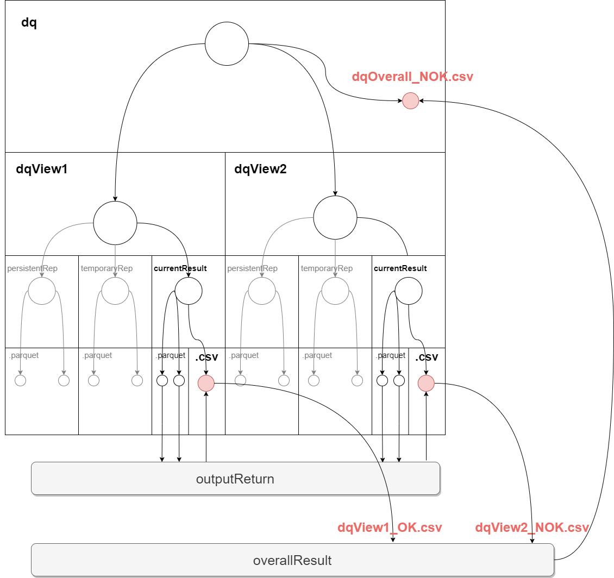
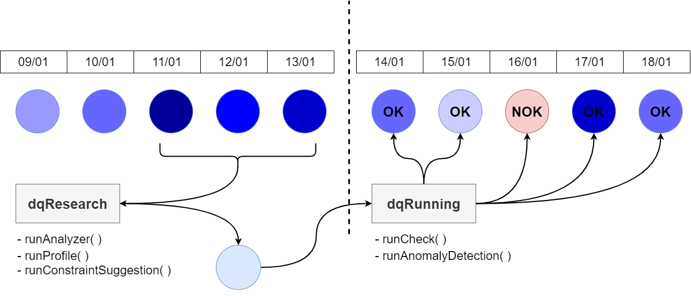

# Arquitetura

## Arquitetura dqRunning
Visao geral da arquitetura de dqRunning, relacionando os arquivos .yaml de entrada e os arquivos .parquet de saída.
Cada um dos blocos de execusao interno sao refletidos em arquivos.py dentro do código fonte da biblioteca, como por exemplo _filtering.py, consolidate.py, persistentRep.py_.

dqRunning_architecture.png

  
  
  
## Arquitetura dqOutput
Processo final da biblioteca, onde é gerado um arquivo .csv único com todos os alertas/erros que foram encontrados nas diversas _views_. Demonstra qual a estrutura interna de diretórios e arquivos que é gerada e manipulada pelo dataquality (a partir do diretório raiz informado na instanciacao do dq).

dqOutput_architecture.png

  
 

## Arquitetura dqRunning - yamlConfigs
Demonstracao de como ocorre o processo de construcao de _views_, onde cada _view_ tem sua estrutura definida por uma série de parametros via arquivos .yaml

dqRunning_viewYamlStructure.png

  
 

## Arquitetura dqRunning - overallJudgement
É a partir de um consenso, levando em conta o resultado de cada uma das diferentes _views_ do processo, que um resultado geral é definido, seja ele OK ou NOK.

dqRunning_overallJudgement.png

  
 

## Arquitetura dqRunning - verificationSuite
Dados de entrada e dados de saída do processo de verificacao (_pydeequ.verification.VerificationSuite_).

dqRunning_verificationSuite.png

  
 

## dqResearch & dqRunning 
Em __*dqResearch*__, módulos responsáveis por analisar datasets e trazer um compreendimento sobre sua estrutura, trazendo valores de média, desvio padrao, número de registros, distribuicoes, reconhecimento de padroes, etc..
 
Em __*dqRunning*__, módulos necessários para realizar avaliacoes sobre datasets, julgando se o dataset esta de acordo ou nao (OK ou NOK) com as restricoes estabelecidas.

modulesRelationship.png