# IntegracaoPRD
### python-feature-store-pe-dq-gut 

Para exemplificar a utilizacao da biblioteca em um cenário real, neste documento será listado o processo de integracao da bibliteca_brn com uma estrutura já existente de dq.

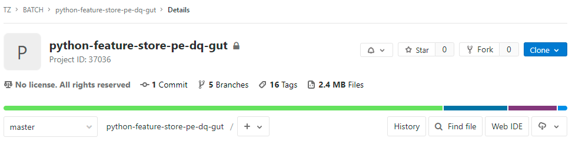

O repositório do dq foi estruturado de forma a ser uma solucao o mais generalista possível. O que facilita a integracao com a lib dataquality_bnr.

As alteracoes necessárias sao poucas, e ficam concetradas em apenas uma parte da estrutura original do repositório.


##### A integracao com dataquality_bnr depende de 4 pontos principias:
* Dependency management
* SparkSession configs
* Yaml files
* myDq.run() 

## Dependency management

A execucao da biblioteca dataquality_bnr ocorre a partir de algumas dependencias externas, por isso é importante garantir que esses arquivos estejam disponíveis e distribuidos atráves dos diferentes drives do cluster, quando o processo de dataquality for executado via spark-submit.

__Inclua as dependencias vias --jars option__:

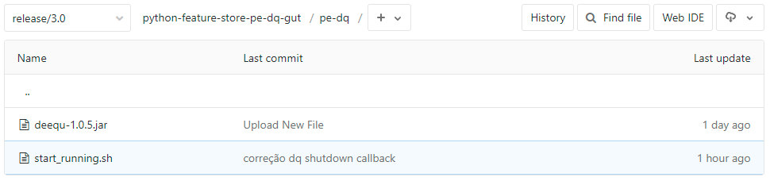

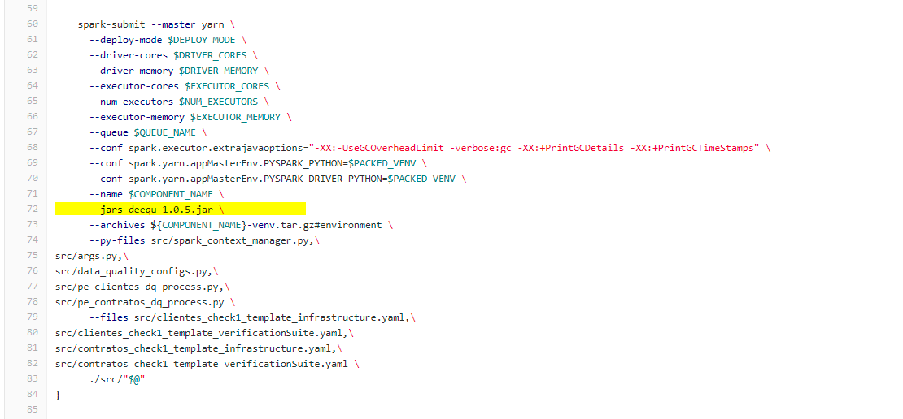

## SparkSession configs

Importante lembrar que __o funcionamento da lib dataquality_bnr depende da instanciacao da sessao spark com essas configuracoes__.
* em __spark.jars__, adicionando o mesmo .jar que foi distribuido no cluster pelo __spark-submit__. (nao pode usar o método do dqSup aqui, o .jar precisa vir da distribuicao do spark-submit)
* em __spark.jars.excludes__, excluido uma dependencia desnecessária com o apoio da do módulo __dqSupport__


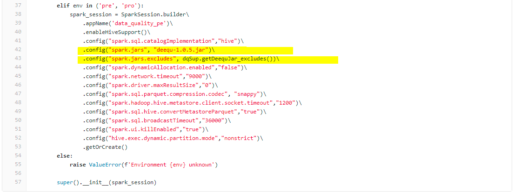

## Yaml files
Todos os arquivos .yaml devem estar dentro do projeto. 

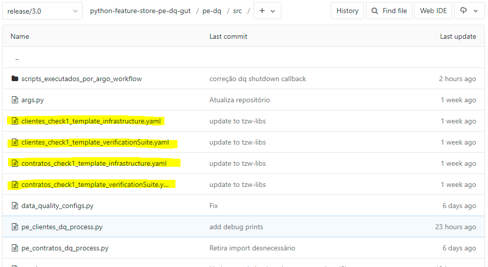

Quando executamos o spark job esses arquivos devem ser acessíveis em cada um dos drives do cluster.

Para isso, spark-submit --files:

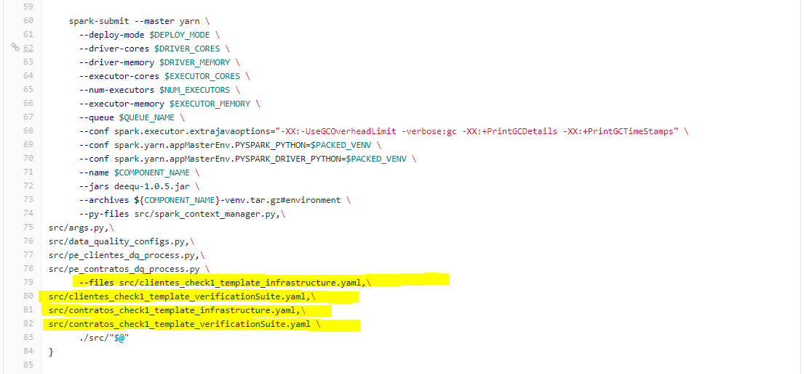

## myDq.run()
O dq em questao, nessa estrutura de repositórios, já tem um arquivo .py específico onde deve ser implementado a execucao do dataquality_bnr.
Neste caso de uso, temos tanto um arquivo para preencher o dq do pe clientes quanto do pe-contratos.

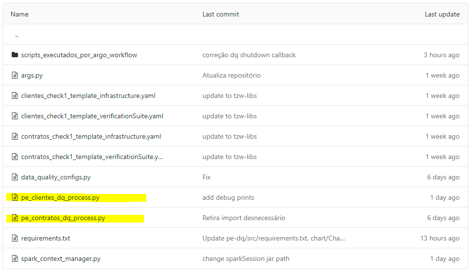

Como a estrutura é muito parecida vamos demonstrar apenas o código do arquivo __pe-clientes__.

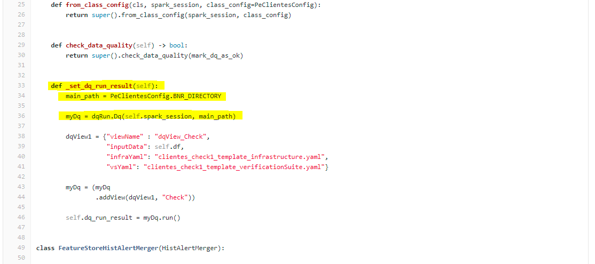

A estrutura de repositórios foi montada de tal forma que precisamos alterar apenas um método nessa classe. Com toda a estrutura já definida, precisamos apenas preencher o método ___set_dq_run_result()__ com o nosso dataquality_bnr.

Além, é claro, de fazer os imports necessários.
Sendo eles:
* a importacao do módulo dqRun, da própria lib dataquality_bnr
* importar classe de configuracao dataquality_config

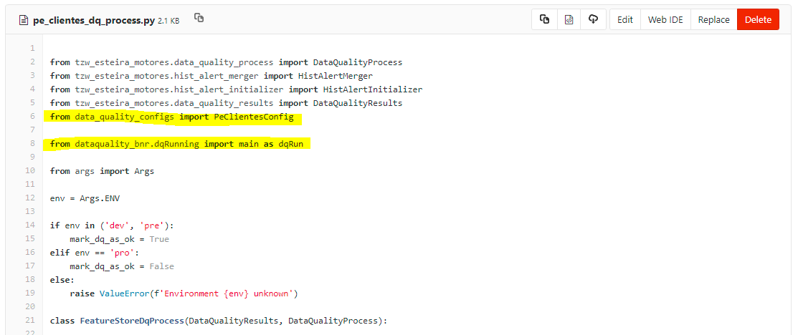

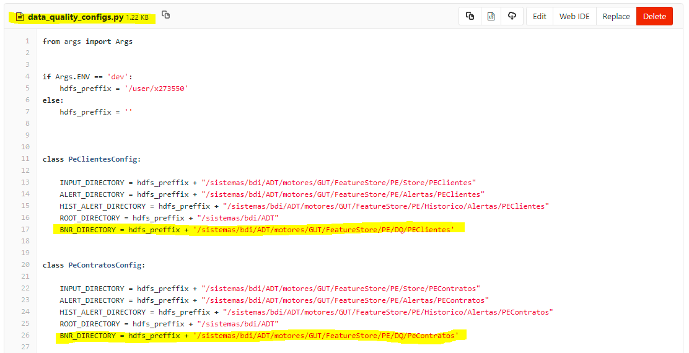

__OBS:__ 
Vale lembrar que todas os arquivos/classes utilizadas no JOB, devem ser submetidos viar spark-submit. Com os arquivos de _processs.py nao é diferente

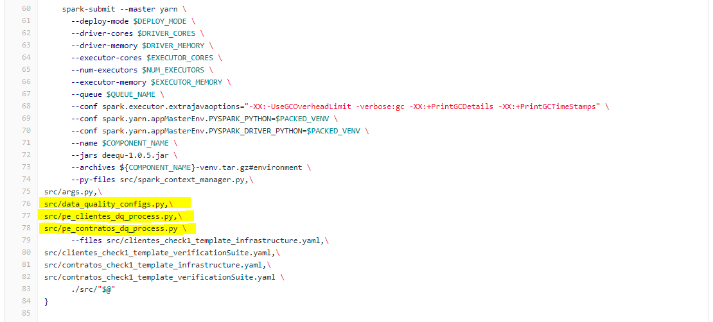

# __Importante!__
No caso específico deste projeto, o spar.stop() está abstraido em outra biblioteca.
Mas é importante deixar claro que ém qualquer job que utilize o __Pydeequ__, e portando o dataquality_bnr, é preciso lembrar de encerrar a sessao spark e o dar um _gateway.shutdown_callback_server(), **evitando que qualquer processo "fantasma" fique pendurado**.

```python
spark.sparkContext._gateway.shutdown_callback_server()
spark.stop()
```


